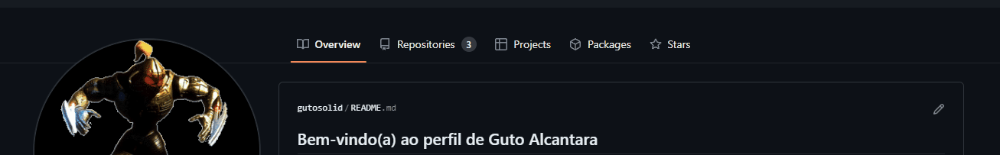

# Projeto com README
Um projeto de teste com um arquivo README 🚀

 (http://google.com)

 <p align="center">
  
</p>


## Tecnologias utilizadas
- HTML
- CSS
- JS

## Como utilizar

Clone o projeto
```
git clone <url>
```

Acesse a pasta do projeto
```
cd repositorio-com-readme
```